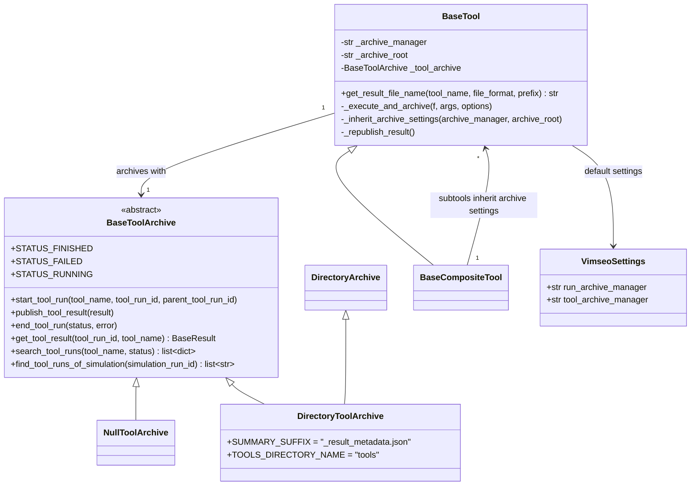

# Archive of the tool results in local directories

## Requirements

- Archive the result of every tool execution, as the simulations already are, so that
  a tool result can be found again from its `tool_run_id` or from a simulation it used.
- Make the archive searchable without opening any result file.
- Never lose a tool result because the archive failed.
- Let a composite tool and its subtools archive in the same place by default.
- Out of scope: the MLflow backend (SPEC-005), loading a result from a URI (SPEC-007).

Acceptance criteria:

- Given a tool executed with the default configuration, then
  `default_archive/tools/{tool_name}/{tool_run_id}/` holds `{tool_name}_result.hdf5`
  and `{tool_name}_result_metadata.json` with `status: FINISHED`.
- Given a tool which raises, then its summary has `status: FAILED` and the error
  message, and the error is raised to the caller.
- Given an archive that cannot be written, then the error is logged and the tool
  returns its result.
- Given a subtool created without archive settings, at any depth, then it archives
  where its top tool does; given a subtool with explicit settings, then it keeps them.
- Given `archive_manager="none"`, or `tool_archive_manager="none"` in the
  configuration, then nothing is written.
- Given any tool class, then its constructor accepts `archive_manager` and
  `archive_root`.

## Entities

## Approach

1. Archive interface:
   - `BaseToolArchive` defines the life cycle of a tool run (`start_tool_run`,
     `publish_tool_result` or `end_tool_run`) and the queries (`get_tool_result`,
     `search_tool_runs`, `find_tool_runs_of_simulation`). The methods are prefixed by
     `tool` because a backend may also archive simulations (MLflow, SPEC-005).
   - `NullToolArchive` archives nothing: the archive can be disabled without `if` in
     the tools.
   - `open_tool_archive(name, root)` selects the backend: `"DirectoryArchive"`,
     `"MlflowArchive"` (lazy import, SPEC-005), `"none"`. It *opens* rather than
     creates: existing runs are kept and searchable.
2. Directory backend:
   - `DirectoryToolArchive` derives from `DirectoryArchive` to reuse its job directory
     management: `{root}/tools/{tool_name}/{tool_run_id}/`.
   - The result is written with `BaseResult.to_hdf5`, under the same name as
     `BaseTool.save_results` (`get_result_file_name`), so that a file opened alone
     tells its tool.
   - A JSON summary (`create_summary`, `summary_to_json`) is written at start
     (`RUNNING`) and rewritten at the end (`FINISHED` or `FAILED`). It holds the
     status, date, VIMSEO version, settings, model, parent and children, simulations
     and key values; the searches only read summaries. Serializing the summary never
     fails (fallback to `repr`, SPEC-001).
3. Wiring in the tools:
   - `BaseTool` takes `archive_manager` and `archive_root` explicitly (not `**kwargs`),
     so that an unknown argument still raises a `TypeError`. Resolution:
     argument → `config.tool_archive_manager` → `config.run_archive_manager`; root:
     argument → `config.database.local_uri` → `default_archive/`.
   - `_execute_and_archive` is shared by `BaseTool.validate` and
     `BaseCompositeTool.validate`: start the run before executing the tool (so that
     simulations can be attached to it), archive the failure and re-raise, then set
     the options and identifiers on the result and publish it.
   - Every call to the archive goes through `_archive`, which logs and swallows the
     errors: a result which took hours must not be lost.
   - `_republish_result()` lets a tool which completes its result after `execute`
     (Bayesian analysis) publish it again.
4. Subtools:
   - `BaseCompositeTool` calls `_inherit_archive_settings` on its subtools after
     building them, recursively. An explicit setting of a subtool wins. The archive is
     reopened only when the resolved settings change.
   - `DeterministicValidationCase` now simulates through its `CustomDOETool` subtool,
     so that each simulation batch is archived as a child run (`cae11057`).
5. Configuration:
   - `archive_manager` of the configuration is renamed `run_archive_manager`,
     symmetric with the new `tool_archive_manager` (`77e8f3ff`). No alias.
   - The tests disable the archive with an autouse fixture in `tests/conftest.py`.
6. Rejected alternatives:
   - Archiving the results in the model run archive: a tool run is not a simulation
     and has a different life cycle (children, failures without outputs).
   - Raising the archive errors: rejected for the reason above.

## Structure

### Inheritance Relationships

1. `NullToolArchive` and `DirectoryToolArchive` implement `BaseToolArchive`.
2. `DirectoryToolArchive` extends `DirectoryArchive`.
3. `BaseCompositeTool` extends `BaseTool` and overrides `_inherit_archive_settings`.

### Dependencies

1. `BaseTool.__init__` calls `_open_tool_archive` → `open_tool_archive`.
2. `BaseTool._execute_and_archive` calls `tool_run` (SPEC-003) and the archive.
3. `DirectoryToolArchive` calls `create_summary`, `summary_to_json`,
   `BaseTool.get_result_file_name`, `BaseTool.load_results`.
4. Every tool with its own constructor passes its options to `BaseTool.__init__`.

### Layered Architecture

1. `storage_management/tool_archive/`: the archives of the tool results, independent
   of any specific tool.
2. `tools/base_tool.py`, `tools/base_composite_tool.py`: the life cycle of a tool run.
3. `config/configuration_settings.py`: the default archive managers.

## Operations

### Create package - `vimseo/storage_management/tool_archive/`

1. `base_tool_archive.py`: `BaseToolArchive` (abstract, statuses as class
   attributes), `NullToolArchive`, `create_summary(tool_name, tool_run_id,
   parent_tool_run_id, status, result=None, error="")`, `summary_to_json(summary)`
   (retry with `skipkeys=True` on non-string keys).
2. `directory_tool_archive.py`: `DirectoryToolArchive(root_directory)`.
   - `start_tool_run`: set experiment `tools/{tool_name}`, run name `tool_run_id`,
     create the job directory, write the `RUNNING` summary.
   - `publish_tool_result`: `to_hdf5`, then the `FINISHED` summary.
   - `end_tool_run`: summary with the status and the error.
   - `get_tool_result`: glob `{tool_name or *}/{tool_run_id}`; `KeyError` if absent or
     without result (message gives the status).
   - `search_tool_runs`: read every summary, filter by status, add `directory` and
     `uri`.
   - `find_tool_runs_of_simulation`: filter the summaries by `simulation_run_ids`.
3. `__init__.py`: `NO_TOOL_ARCHIVE = "none"`, `open_tool_archive(name, root)`;
   `ValueError` listing the available managers.

### Update tool - `BaseTool`

1. `ToolConstructorSettings`: add `archive_manager: str | None = None`,
   `archive_root: str | Path = ""`.
2. `__init__`: accept both, open the archive.
3. `_execute_and_archive`, `_archive`, `_republish_result`,
   `_inherit_archive_settings`, `_open_tool_archive` as described in Approach.
4. `get_result_file_name(tool_name, file_format="hdf5", prefix="")` →
   `{prefix}_{tool_name}_result.{file_format}`, used by `save_results`.

### Update tool - `BaseCompositeTool`

1. After `super().__init__`, make the subtools inherit the archive settings.
2. Use `_execute_and_archive` in `validate`.

### Update the tools with their own constructor

1. Verification tools, `DirectMeasures`, file readers: pass `**options` to the base
   constructor.

### Update configuration - `VimseoSettings`

1. Rename `archive_manager` → `run_archive_manager`; add
   `tool_archive_manager: str | None = None`.
2. Update `CHANGELOG.md`, `docs/user_guide/vimseo.env`, `docs/how_to/configuration.md`.

### Update tests

1. `tests/conftest.py`: autouse fixture setting `config.tool_archive_manager = "none"`.
2. `tests/storage_management/test_tool_archive.py`: life cycle, failure, search,
   nesting, explicit setting precedence, constructors of all tools.

## Norms

1. The shared norms of `docs/specs/index.md`.
2. Every archive call from a tool goes through `BaseTool._archive`.
3. The result file name is built only by `BaseTool.get_result_file_name`.
4. A backend shipped by an extra is imported inside `open_tool_archive`, after
   `import_optional`.

## Safeguards

1. Functional: an archive error never prevents the tool from returning its result.
2. Functional: a failing tool is archived as `FAILED` and the original exception is
   raised unchanged.
3. Functional: a run interrupted (killed process) stays `RUNNING`.
4. Integration: the archive is enabled by default, with the simulations' manager, in
   `default_archive/`.
5. Breaking change `77e8f3ff` (`refactor(config)!`): `VIMSEO_ARCHIVE_MANAGER` →
   `VIMSEO_RUN_ARCHIVE_MANAGER`. The old key in a `.env` file makes `VimseoSettings()`
   fail with a `ValidationError`; in the process environment it is silently ignored.
6. Breaking change: results can no longer be saved or loaded as pickle.
7. Tests: the default run must not write in the working directory (REQ-NFR-004).

## Open questions

1. `DirectoryToolArchive` inherits many simulation methods of `DirectoryArchive` it does
   not use. Is composition preferable to inheritance?
2. `find_tool_runs_of_simulation` reads every summary: acceptable for thousands of
   runs, not beyond. Should an index be written?
3. The old `VIMSEO_ARCHIVE_MANAGER` environment variable is silently ignored. Should a
   warning be logged?
4. Should the archive be enabled by default, given that it writes in
   `default_archive/` of the current directory?
