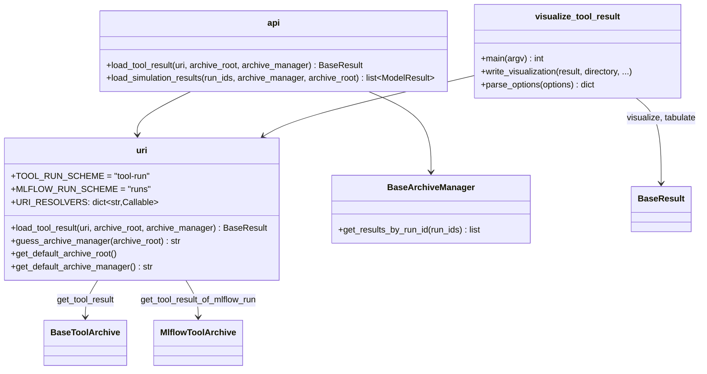

# Load tool results and simulations by reference; visualize_tool_result CLI

## Requirements

- Let users address a tool result by a single string (URI), whatever the archive
  holding it, and load it from Python or from the command line.
- Let users load the simulations used by a tool result from their `run_id`, without
  creating their model.
- Let a reviewer who does not write Python get the figures, tables and metadata of
  tool results in a directory.
- Out of scope: writing the archives (SPEC-004, SPEC-005), the figures themselves
  (SPEC-006).

Acceptance criteria:

- Given `path/to/{tool}_result.hdf5`, a tool run directory
  `{root}/tools/{tool}/{tool_run_id}`, `tool-run:{tool_run_id}` or
  `runs:/{mlflow_run_id}`, when `vimseo.api.load_tool_result(uri, archive_root,
  archive_manager)` is called, then the result is returned.
- Given `tool-run:{id}` without `archive_manager`, then the manager is guessed from
  `archive_root`: a `tools` directory for a directory archive, `0/meta.yaml` for a
  local MLflow database.
- Given a Windows path `C:\...`, then it is read as a path, not as a scheme.
- Given the `simulation_run_ids` of a result, when
  `vimseo.api.load_simulation_results(run_ids, archive_manager, archive_root)` is
  called, then the `ModelResult`s are returned in the same order; a missing one raises
  `KeyError`.
- Given `visualize_tool_result --uri <uri> [--uri ...]`, then
  `{output_dir}/{name}/` holds the figures, the tables (CSV) and the metadata of each
  result; `--list-options` prints the visualization settings; `--option key=json`
  sets one.

## Entities

## Approach

1. URIs:
   - Four forms: a result file, a tool run directory, `tool-run:{tool_run_id}`,
     `runs:/{mlflow_run_id}` (the MLflow convention).
   - A scheme has at least two characters, so that a drive letter is a path.
   - The schemes are resolved by functions registered in `URI_RESOLVERS`, so that a
     new archive can plug its own scheme.
   - `tool-run:` uses the given manager, else guesses it from the root, else the
     configuration; it also falls back to the archive of the simulations when the tool
     results are not archived (`c7bf6e46`).
2. Simulations by `run_id`:
   - `get_results_by_run_id(run_ids)` on the archives of the simulations searches the
     whole archive, whatever the experiment, since a tool result may use several
     models.
   - `MlflowArchive` creates its experiment with its first run: opening it to read no
     longer creates an empty experiment.
3. Command line:
   - `visualize_tool_result` (entry point in `pyproject.toml`) writes, per URI, the
     figures (`--format html|png|svg`), the tables as CSV and the metadata as JSON;
     `--no-figures`, `--no-tables`.
   - Settings are passed as `--option key=<JSON>` and validated by the result's
     settings class; `--list-options` prints them.
4. Rejected alternatives:
   - One function per archive kind: users would need to know where the result is.
   - Always using the configured archive manager for `tool-run:`: it failed with the
     root of an MLflow archive (`286219b3`).

## Structure

### Inheritance Relationships

1. `DirectoryArchive` and `MlflowArchive` implement
   `BaseArchiveManager.get_results_by_run_id`.

### Dependencies

1. `vimseo.api` → `storage_management.tool_archive.uri`, `get_archive_class`.
2. `uri` → `open_tool_archive`, `DirectoryToolArchive`, `load_result_file`.
3. `visualize_tool_result` → `uri.load_tool_result`, `BaseResult.visualize`,
   `BaseResult.tabulate`.

### Layered Architecture

1. `api.py`: the public entry points (lazy imports).
2. `storage_management/tool_archive/uri.py`: URI resolution.
3. `tools/visualize_tool_result.py`: the command line.

## Operations

### Create - `vimseo/storage_management/tool_archive/uri.py`

1. Constants `TOOL_RUN_SCHEME`, `MLFLOW_RUN_SCHEME`, `_SCHEME_PATTERN`.
2. `get_default_archive_root()`, `get_default_archive_manager()`,
   `guess_archive_manager(root)`.
3. `_load_from_tool_run_id`, `_load_from_mlflow_run`, `_load_from_path` (file or tool
   run directory); `URI_RESOLVERS`.
4. `load_tool_result(uri, archive_root="", archive_manager="")`: dispatch on the scheme,
   else path; clear `ValueError`/`KeyError` messages.

### Add - `get_results_by_run_id`

1. `BaseArchiveManager.get_results_by_run_id(run_ids)` (abstract contract and
   docstring), implemented by `DirectoryArchive` and `MlflowArchive`.

### Update - `vimseo/api.py`

1. `load_tool_result(uri, archive_root="", archive_manager="")`.
2. `load_simulation_results(run_ids, archive_manager="", archive_root="")`.

### Create - `vimseo/tools/visualize_tool_result.py`

1. `parse_options`, `get_output_directory_name`, `write_visualization`,
   `_create_parser`, `main(argv) -> int`.
2. Register the entry point `visualize_tool_result` in `pyproject.toml`; document it in
   `docs/user_guide/cli.md` and `CLAUDE.md`.

### Documentation

1. Examples `13_tool_result_management/plot_01_tool_results_in_directories.py` and
   `plot_02_tool_results_in_mlflow.py`.

### Tests

1. `tests/storage_management/test_tool_result_uri.py`,
   `tests/storage_management/test_results_by_run_id.py`,
   `tests/tools/test_visualize_tool_result.py`.

## Norms

1. The shared norms of `docs/specs/index.md`.
2. Every public loading function is exposed in `vimseo.api`, with lazy imports.
3. A new URI scheme is added to `URI_RESOLVERS`, never by an `if` in
   `load_tool_result`.
4. CLI errors are reported with a non-zero return code and a readable message.

## Safeguards

1. Functional: a Windows path is never parsed as a URI scheme.
2. Functional: reading an MLflow archive never creates an experiment.
3. Integration: `runs:/` needs the `mlflow` extra; the other forms do not.
4. Performance: `get_results_by_run_id` searches the whole archive.
5. Tests: the three test modules above, on both backends.

## Open questions

1. Should `load_simulation_results` take the manager and root from the tool result
   (or its archive), instead of the configuration?
2. Should `visualize_tool_result` accept a search (e.g. all the runs of a tool) rather
   than explicit URIs?
3. Is guessing the archive manager from the content of the root directory robust
   enough, e.g. for a remote MLflow server?
